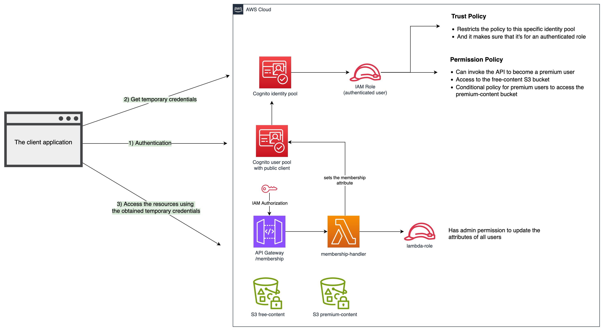

# attribute-based access control

This example demonstrates the implementation of [attribute-based access control](https://docs.aws.amazon.com/IAM/latest/UserGuide/introduction_attribute-based-access-control.html) in a serverless architecture by combining several AWS services.

## Components

Follow the README files in each directory for the setup instructions. Note that the frontend will only work if the backend is deployed first.

* [Backend](./backend/README.md) - Manages the application infrastructure and backend logic.
* [Frontend](./frontend/README.md) - A set of Node.js scripts that handles the authentication flow (sign-up, sign-in, etc.) through AWS SDK and libraries.
