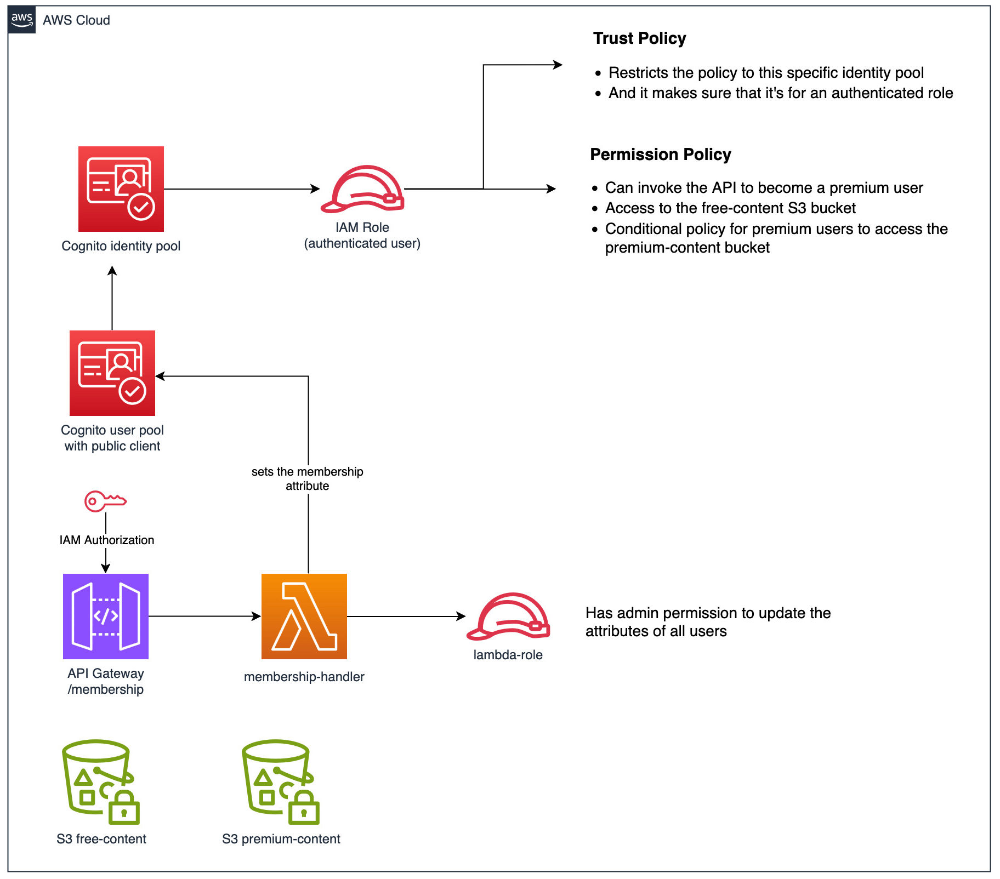

# attribute-based access control - backend

The backend of the application defines the infrastructure shown in the diagram and manages the backend logic.



The following section provides a brief overview of the components and their configurations.

#### 1. Cognito User pool

- Configured to create a new user with email, given name and password.
- The email is used as the username.
- Defines an optional custom attribute `custom:membership`.

#### 1.1 Cognito User pool client

- It's a public client, so there is no client secret.
- Configured to use the [Authorization Code Grant](https://aws.amazon.com/blogs/security/how-to-use-oauth-2-0-in-amazon-cognito-learn-about-the-different-oauth-2-0-grants/).
- Configured to support only [Secure Remote Password (SRP)](https://docs.aws.amazon.com/cognito/latest/developerguide/amazon-cognito-user-pools-authentication-flow.html) authentication for enhanced security.
- Gives only `read-only` access to the `custom:membership` attribute.
- Sets the access token to have a validity of 1 hour.

#### 2. Cognito Identity pool

- Configured to use the user pool as the identity provider.
- Has a role that authenticated users can assume.
- Maps the user attribute `custom:membership` to be used as a principal tag.

#### 3. IAM role

- The trust policy of the role ensures that only authenticated users from this specific identity pool can assume it.
- The permission policy grants authenticated users:
  - Access to the free content bucket
  - Permission to invoke the `/membership` API Gateway endpoint
- The permission policy uses the [PrincipalTag](https://docs.aws.amazon.com/IAM/latest/UserGuide/access_iam-tags.html) condition to grant access to the premium content bucket if the user has the `premium` membership.

#### 4. API Gateway `/membership`

- The POST endpoint is protected by [IAM authorization](https://docs.aws.amazon.com/apigateway/latest/developerguide/http-api-access-control-iam.html).
- Requests should be signed using [Signature Version 4 (SigV4)](https://docs.aws.amazon.com/IAM/latest/UserGuide/create-signed-request.html) with the AWS credential.
- Is configured to invoke the `membership` Lambda function.

#### 5. Lambda `membership-handler`

- Upon invocation, the function adds the `custom:membership` attribute with the value `premium` to the user.
- Has admin permission to update the attributes of all users in the user pool.

#### 6. S3 buckets

- The free and premium content buckets are private.
- The free content bucket is accessible to all the authenticated users, regardless of their membership.
- The premium content bucket is accessible only to authenticated users with the `premium` membership.

## Deployment

First, clone the project to local:

```shell
git clone git@github.com:m-sureshraj/serverless-examples.git
cd attr-based-access-ctrl/backend
```

install the dependencies:

```shell
npm install
```

finally, deploy the project to AWS

```shell
sls deploy --verbose
```

> Make sure to include the `--verbose` flag when running the sls deploy command. This will instruct the command to print the stack outputs.

A successful deployment prints a similar output:

```
✔ Service deployed to stack attr-based-acc-ctrl-dev

endpoint: POST - https://xxx.execute-api.<region>.amazonaws.com/membership
functions:
  membership: attr-based-acc-ctrl-dev-membership

Stack Outputs:
  freeContentBucketName: <free-content-bucket-name>
  apiEndpoint: https://xxx.execute-api.<region>.amazonaws.com
  userPoolClientId: xxx
  premiumContentBucketName: <premium-content-bucket-name>
  HttpApiId: xxx
  userPoolId: xxx
  identityPoolId: <region>:xxx
  ServerlessDeploymentBucketName: attr-based-acc-ctrl-dev-serverlessdeploymentbucket-xxx
  HttpApiUrl: https://xxx.execute-api.<region></region>.amazonaws.com
```

Some [configurations](./serverless.yml#L39) from the Stack Outputs will be automatically copied
to the `frontend/config/aws.json` file to be used by the frontend.

## Testing the application

Refer to the frontend [README.md](../frontend/README.md) for instructions on testing
the app functionalities, such as sign-up, sign-in, and accessing free and premium contents.

> [!TIP]
> Manually upload one or two files to both S3 buckets to list them during the testing.
