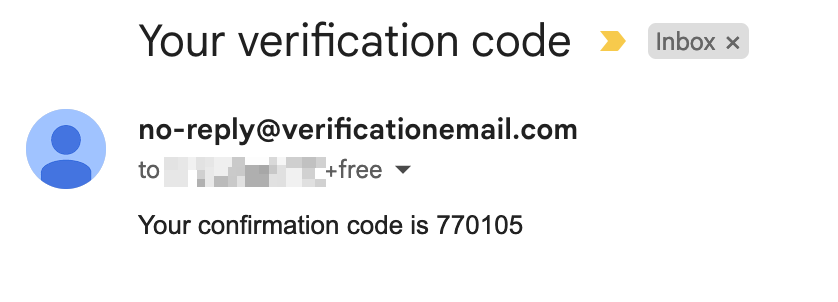
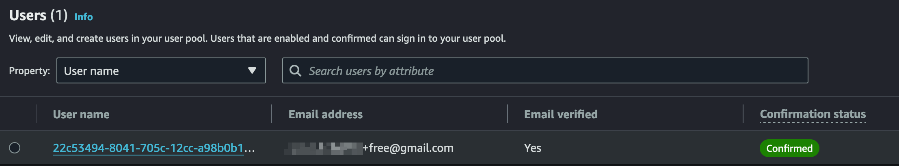

# attribute-based access control - frontend

The frontend of the application handles the authentication flow (sign-up, sign-in, etc.) through AWS SDK and libraries.
It does this through a set of Node.js scripts to quickly build the functionality. However, the same principles is
applied to the real frontend (browser) application as well.

## Pre-requisites

* Ensure that the backend application is [deployed](../backend/README.md#deployment) first.
  > A successful deployment will copy the required AWS configurations such as User pool ID, 
  Identity pool ID, S3 bucket names to the git-ignored `./config/aws.json` file to be used in the authentication flow.

## Installation

Ensure that you are in the frontend directory and run the following command:

```shell
npm install
```

## Configure the user's credentials 

There are two types of users in the application: free and premium.
All attributes are required, and the `username` must be a valid email address.
In a browser application, these fields are filled in during sign-up.

```json
{
  "free": {
    "username": "<valid email address>",
    "password": "",
    "givenName": ""
  },
  "premium": {
    "username": "<valid email address>",
    "password": "",
    "givenName": ""
  }
}
```

* Copy `./config/users.local.json` to `./config/users.json`. The new file is git-ignored.
* Update the `username`, `password`, and `givenName` attributes for the free-type user.

> [!TIP]  
> If you have a gmail account, use `+` trick to create unique email addresses. e.g. `foo+user-1@gmail.com`.

## Testing the application

### Create a new user

The following command creates a new free-type user using the credentials set up in the `./config/users.json` file.

```shell
npm run signup userType=free
```

The email address receives a verification code if the user is created successfully.



### Confirm the registration

After the registration, the user account must be confirmed using the verification code.

```shell
npm run confirm userType=free confirmationCode=<verification code>
```



### Login to the application

The command uses the credentials set up earlier to log in to the application. A successful login will:

  * Receive tokens (ID, Access, and Refresh) from Cognito.
  * Fetch temporary AWS credentials from Identity Pool using the obtained tokens.
  * Store both the tokens and temporary credentials under the `free` user in the `./config/users.json` file.

```shell
npm run signin userType=free
```

### Access the AWS resources

The free-type user has the following permissions in the application: 

* Read access to the S3 bucket that contains free contents.
* Access to the `/membership` api gateway endpoint to become a premium user.

The command below lists the free contents from the `dev-attr-based-acc-ctrl-free-content` S3 bucket.

```shell
npm run list-bucket userType=free
```

The command prints a similar output:  

```
{
  ...
  IsTruncated: false,
  Marker: '',
  MaxKeys: 2,
  Name: 'dev-attr-based-acc-ctrl-free-content',
  Prefix: ''
}  
```

Check if the free-type user has access to the premium contents.
The command below tries to list the premium contents by explicitly specifying the bucket name.

```shell
npm run list-bucket userType=free bucketName=dev-attr-based-acc-ctrl-premium-content
```

The command should receive Access Denied response.

```
AccessDenied: Access Denied
  ...  
  '$fault': 'client',
  '$metadata': {
    httpStatusCode: 403,
    ...
  },
  Code: 'AccessDenied',
  RequestId: 'xxx',
  HostId: ''
}
```

### Become a premium user

The command below calls the `/membership` endpoint to upgrade the membership of the user to a premium user. 

```shell
npm run become-premium-user userType=free
```

If the command succeeds, it will print the following message:

```
{ message: 'Membership updated successfully' }
```

Rename the `free` attribute to `premium` and the `premium` attribute to `free` in `./config/users.json`.

### Access the AWS resources as a premium user

Premium users have access to both the free and premium contents.

```shell
# lists the premium contents from the `dev-attr-based-acc-ctrl-premium-content` S3 bucket
npm run list-bucket userType=premium

# lists the free contents
npm run list-bucket userType=premium bucketName=dev-attr-based-acc-ctrl-free-content
```

### Refresh the session (Optional)

The temporary AWS credentials expire after 1 hour. They can be refreshed by running the following command.

```shell
npm run refresh-session userType=<free | premium>
```

> [!NOTE]  
> We created a free-type user and upgraded to premium. You can additionally create a free-type user for testing purposes.
