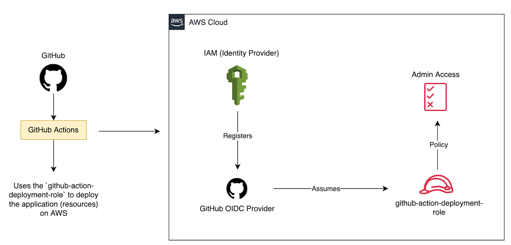
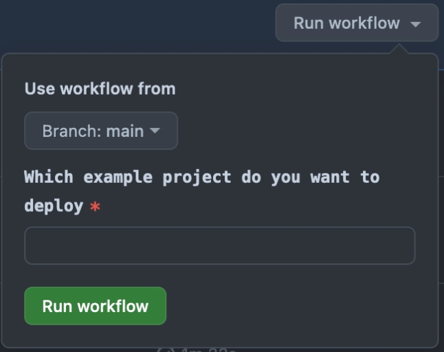

# deployment-with-github-actions

This example project demonstrates how to securely deploy an application to AWS using GitHub Actions.
It uses [OpenID Connect (OIDC)](https://docs.github.com/en/actions/deployment/security-hardening-your-deployments/about-security-hardening-with-openid-connect) for secure authentication with AWS.
This eliminates the need to store AWS credentials as long-lived GitHub secrets.



## Goals

- Build and run tests whenever a pull request includes changes to this example project. [Workflow file: [build-test.yml](../.github/workflows/build-test.yml)]
- Manually deploy one of the example projects in the repository to the `development` environment on AWS. [Workflow file: [deploy-to-dev-env.yml](../.github/workflows/deploy-to-dev-env.yml)]

## Prerequisites

- Add the GitHub OIDC provider to IAM. This is a manual step and can be done by following the instructions [here](https://docs.aws.amazon.com/IAM/latest/UserGuide/id_roles_providers_create_oidc.html#manage-oidc-provider-console).
  - Use `https://token.actions.githubusercontent.com` for the provider URL.
  - Use `sts.amazonaws.com` for the audience.
  - Don't assign an IAM role to the OIDC provider yet. The IAM role is defined in the [infra/resources.yml](./infra/resources.yml) file and
    will be created during the deployment.
- Update the `GithubRepoOwner` variable in the custom section of the [serverless.yml](./serverless.yml) file to match your GitHub username.
- This example project requires forking this repository.

> [!NOTE]
> The `GithubRepoOwner` and `GithubRepoName` variables are used in the `GithubActionDeploymentRole`
> IAM [role](./infra/resources.yml) to allow the workflow to deploy only from the specified repository.
> Read this [guide](https://docs.github.com/en/actions/deployment/security-hardening-your-deployments/about-security-hardening-with-openid-connect) to understand the security implications behind this decision.
>
> The IAM role is configured to have admin-level permission. However, it's best practice to 
> give only the necessary permissions to deploy the resources.

## Deployment

First, clone the project to local:

```shell
git clone git@github.com:m-sureshraj/serverless-examples.git
cd deployment-with-github-actions
```

install the dependencies:

```shell
npm install
```

Next, deploy the project to AWS. The first deployment needs to be done manually.

```shell
sls deploy --verbose
```

> Make sure to include the `--verbose` flag when running the sls deploy command. This will instruct the command
> to print the stack outputs.

A successful deployment prints a similar output:

```
✔ Service deployed to stack deployment-with-github-actions-dev (18s)

endpoint: GET - https://xxx.execute-api.eu-west-2.amazonaws.com/
functions:
  api: deployment-with-github-actions-dev-api (320 B)

Stack Outputs:
  GithubActionDeploymentRoleARN: arn:aws:iam::xxx:role/github-action-deployment-role-dev
```

> [!NOTE]
> Take a note of the `GithubActionDeploymentRoleARN` output. It is needed to configure the environment variables for GitHub Actions.

## Configure the Environment

Environments like `development`, `staging` and `production` are used to store the environment-specific variables and
secrets to be used by workflows in GitHub Actions. Refer to this [guide](https://docs.github.com/en/actions/managing-workflow-runs-and-deployments/managing-deployments/managing-environments-for-deployment) for more details.

Create an environment named `development` and configure the variable and secret values as follows:

- Environment Secrets:
  - `AWS_GITHUB_ACTIONS_DEPLOYMENT_IAM_ROLE_ARN` - The value should be the `GithubActionDeploymentRoleARN` output from the previous step.
- Environment Variables:
  - `AWS_REGION` - The AWS region where the application is deployed. Ensure that the same region is configured in the `serverless.yml` file.

## GitHub Actions Workflows

- The [build-and-test](../.github/workflows/build-test.yml) workflow is triggered by a pull request that includes changes to this example project.
- The [deployment](../.github/workflows/deploy-to-dev-env.yml) workflow is triggered manually.
  It takes the name of an example project in the repository as input and deploys the project to the `development` environment.


