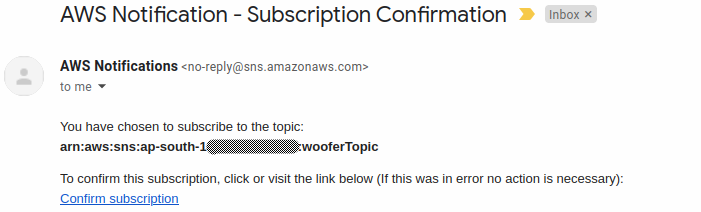
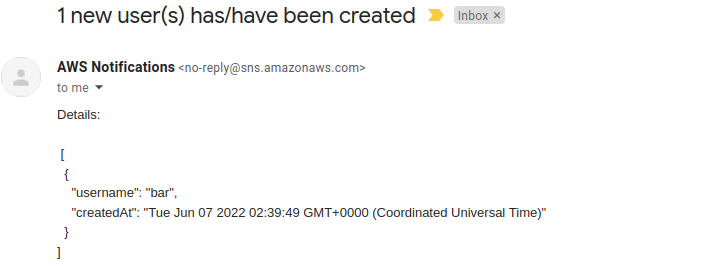

# dynamodb-streams

This example reimplements AWS developer guide [tutorial](https://docs.aws.amazon.com/amazondynamodb/latest/developerguide/Streams.Lambda.Tutorial.html) (`Process New Items with DynamoDB Streams and Lambda`) with slight modification through Serverless Framework.


[Source](https://docs.aws.amazon.com/amazondynamodb/latest/developerguide/images/StreamsAndTriggers.png)

## Deployment

First, clone the project to local:

```bash
> git clone git@github.com:m-sureshraj/serverless-examples.git
> cd dynamodb-streams 
```

Configure environment variables:

```bash
> cp .env.sample.yml .env.dev.yml
```

Add your email address to the `EMAIL_SUBSCRIBER: foo@bar.com` variable.

```bash
> sls deploy
```

A successful deployment print a similar output:

```
✔ Service deployed to stack dynamodb-streams-dev (163s)

endpoint: POST - https://xxxxxxx.execute-api.ap-south-1.amazonaws.com/
functions:
  bark: dynamodb-streams-dev-bark (46 kB)
  dbChangeListener: dynamodb-streams-dev-dbChangeListener (46 kB)
```

After successful deployment, `SNS` sends a subscription confirmation email to the configured email address. 
Click confirm subscription link to subscribe to that topic.



## Testing

Get the endpoint from the sls deploy output and send a `POST` request to it.

```bash
curl -X POST https://xxxxxxx.execute-api.ap-south-1.amazonaws.com/ \
-H 'Content-Type: application/json' -d '{ "username": "bar" }'
```

You should receive the notification email to the configured email address.


