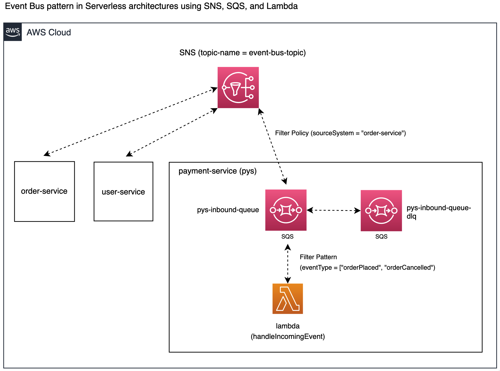

# event-bus-via-sns

This example demonstrates the implementation of the [Event Bus pattern](https://medium.com/elixirlabs/event-bus-implementation-s-d2854a9fafd5) 
in Serverless architectures using SNS, SQS, and Lambda services. In particular, it focuses on the payment-service 
and the SNS topic (`event-bus-topic`) shown in the following diagram:



The application provisions following resources:

#### 1. Lambda function `incomingEventHandler` 
It uses the `pys-inbound-queue` queue as the event source. 
When a message is received by the queue with the attribute `eventType` set to either `orderPlaced` or `orderCancelled`, 
the Lambda service will invoke the function.

#### 2. Queue `pys-inbound-queue` 
It subscribes to the SNS topic and uses the `FilterPolicy` feature to exclusively receive messages from the order-service.
Additionally, it has been configured with a dead-letter queue (DLQ) to forward messages that have failed to be processed after 3 attempts.

#### 3. Queue `pys-inbound-queue-dlq`
It receives messages that have failed to be processed by the `pys-inbound-queue` queue.
And it uses the queue's default retention period of 4 days to retain the messages. 
Once the retention period is reached, the messages are automatically deleted.

#### 4. SNS topic `event-bus-topic`
It's the shared SNS topic that enables communication between different services within the system. 
While this service provisions the shared SNS topic, it's generally recommended to maintain shared resources 
separately to allow other services to access it.

## Deployment

First, clone the project to local:

```shell
git clone git@github.com:m-sureshraj/serverless-examples.git
cd event-bus-via-sns
```

install the dependencies:

```shell
npm install
```

finally, deploy the project to AWS

```shell
sls deploy --verbose
```

> Make sure to include the `--verbose` flag when running the sls deploy command. This will instruct the command to print the stack outputs.

A successful deployment prints a similar output:

```
✔ Service deployed to stack payment-service-dev (25s)

functions:
  incomingEventHandler: payment-service-dev-incomingEventHandler (170 kB)

Stack Outputs:
  IncomingEventHandlerLambdaFunctionQualifiedArn: arn:aws:lambda:eu-west-2:xxx:function:payment-service-dev-incomingEventHandler:4
  SNSTopicArn: arn:aws:sns:eu-west-2:xxx:event-bus-topic-dev
  ServerlessDeploymentBucketName: payment-service-dev-serverlessdeploymentbucket-xxx
```

## Testing

The following `aws` cli command can be used to publish a message to the previously created SNS topic. 
This simulates how the order-service would communicate with the payment-service to inform about the `orderPlaced` event.

```shell
aws sns publish --topic-arn <the-topic-arn> \ 
 --message-attributes '{ "sourceSystem": {"DataType": "String", "StringValue": "order-service" }}' \
 --message '{ "eventType": "orderPlaced" }'
```

The following are the log outputs of the function that processed the message:

```
INFO	Received the orderPlaced event from order-service
INFO	{
  body: '{ "eventType": "orderPlaced" }',
  attributes: { ... },
  messageAttributes: {
    sourceSystem: {
      stringValue: 'order-service',
      dataType: 'String'
      ...
    }
  },
  ...
}
```
