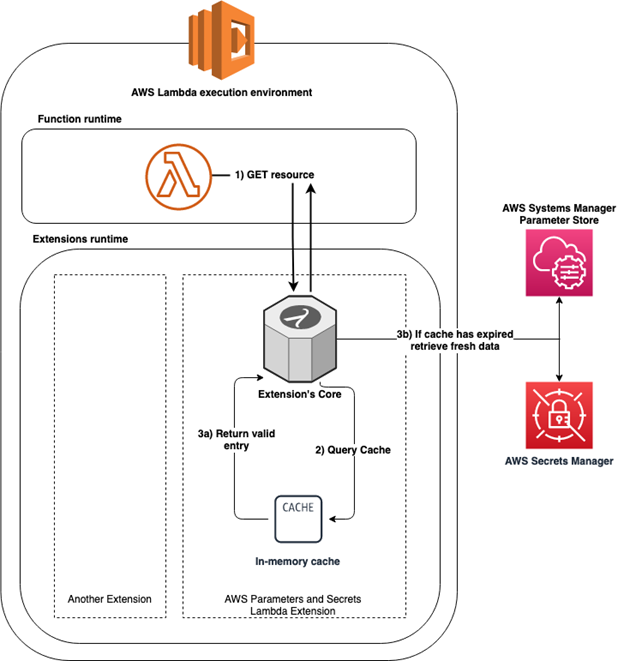

# secrets-manager

This example demonstrates how to access [Secrets Manager](https://aws.amazon.com/secrets-manager/) in a Lambda function 
using the `aws-sdk` and the `AWS Parameters and Secrets Lambda Extension`. This [guide](https://aws.amazon.com/blogs/compute/using-the-aws-parameter-and-secrets-lambda-extension-to-cache-parameters-and-secrets/) 
provides more details on how to integrate and use the Lambda extension.

The application provisions following resources:

1. Lambda function `secret-via-sdk` - uses `aws-sdk` to access Secrets Manager
2. Lambda function `secret-via-lambda-extension` - uses the Lambda extension to access Secrets Manager
3. Secrets Manager > secret `random-credentials` - it has a preconfigured username and an autogenerated password field

Secret rotation is disabled for the secret, meaning the use of either approach, `aws-sdk` or `Lambda extension`, has the same effect. 
Actually, using the `aws-sdk` to fetch and cache the secret outside the handler is the simplest solution. 
But if secret rotation is enabled, it has to implement custom logic to refresh the cache at an interval, whereas the 
`Lambda extension` handles fetching, caching and refreshing out of the box.

High-level view of the components involved in the Lambda extension. [Source](https://d2908q01vomqb2.cloudfront.net/1b6453892473a467d07372d45eb05abc2031647a/2022/11/17/secrets1.png)



## Deployment

First, clone the project to local:

```shell
git clone git@github.com:m-sureshraj/serverless-examples.git
cd secrets-manager
```

install the dependencies:

```shell
npm install
```

finally, deploy the project to AWS

```shell
sls deploy --verbose
```

A successful deployment print a similar output:

```
Deploying secrets-manager to stage dev (eu-west-2)

✔ Service deployed to stack secrets-manager-dev (110s)

endpoints:
  GET - https://xxx.execute-api.eu-west-2.amazonaws.com/retrieve-secret-via-sdk
  GET - https://xxx.execute-api.eu-west-2.amazonaws.com/retrieve-secret-via-lambda-ext
functions:
  secret-via-sdk: secrets-manager-dev-secret-via-sdk (27 kB)
  secret-via-lambda-extension: secrets-manager-dev-secret-via-lambda-extension (27 kB)
```

## Testing

Get the endpoints from the `sls deploy` output and send individual `GET` requests to each of them.

```shell
curl https://xxx.execute-api.eu-west-2.amazonaws.com/retrieve-secret-via-sdk
```

The response should include an auto-generated password and the configured username.

```
{"password":"doB3.mfC8#gUOtZB;Uw;'fgq~JX=&K","username":"test-user"}
```
